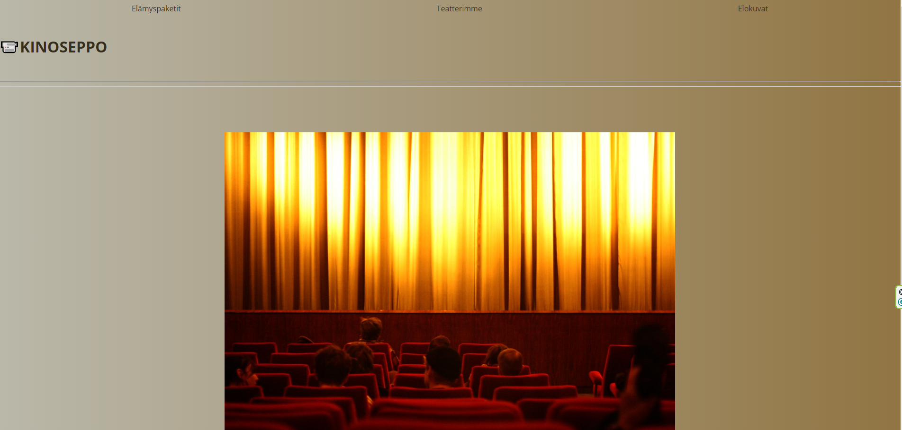

# KinoSeppo

KinoSeppo on elokuvateatterisovellus, joka mahdollistaa elokuvaelämysten varaamisen. Tämä projekti on tehty ryhmätyönä kouluprojektina.

## Sovelluksen kuvaus

KinoSeppo tarjoaa käyttäjille mahdollisuuden tehdä elokuvaelämyspyyntöjä. Käyttäjät voivat syöttää nimensä, puhelinnumeronsa, sähköpostiosoitteensa ja viestinsä, jossa he voivat kertoa toiveensa elokuvasta ja tarjoilusta.

## Asennusohjeet

1. **Kloonaa tämä repositorio:**
    ```sh
    git clone https://github.com/lssaarinen/kinoseppo
    ```
2. **Siirry projektin hakemistoon:**
    ```sh
    cd kinoseppo
    ```
3. **Luo tietokanta ja taulut:**

    Luo MySQL-tietokanta ja taulu seuraavalla SQL-lauseella:
    ```sql
    CREATE DATABASE kinoseppo CHARACTER SET utf8mb4 COLLATE utf8mb4_general_ci;
    USE kinoseppo;
    
    CREATE TABLE tarjouspyynto (
      idpyynto INT UNSIGNED AUTO_INCREMENT PRIMARY KEY,
      nimi VARCHAR(50),
      puhelinnumero VARCHAR(20),
      email VARCHAR(50) NOT NULL,
      viesti TEXT,
      lahetetty TIMESTAMP DEFAULT CURRENT_TIMESTAMP
    );
    ```

4. **Luo konfiguraatiotiedosto ympäristömuuttujille:**

    Luo tiedosto `.env` ja lisää seuraavat rivit:
    ```env
    DB_DATABASE=kinoseppo
    DB_USERNAME=your_db_username
    DB_PASSWORD=your_db_password
    ```

5. **Asenna PHP-kirjastot (tarvittaessa):**

    Varmista, että sinulla on asennettuna tarvittavat PHP-kirjastot (kuten PDO) ja että palvelin on konfiguroitu oikein.

6. **Käynnistä palvelin:**

    Voit käyttää paikallista kehityspalvelinta, kuten PHP:n sisäänrakennettua palvelinta:
    ```sh
    php -S localhost:8000
    ```

## Käyttö

- Käy `elamys.php`-sivulla ja täytä lomake.
- Lomakkeen lähettämisen jälkeen tiedot tallennetaan tietokantaan ja käyttäjä ohjataan onnistumissivulle tai virhesivulle riippuen syötteen oikeellisuudesta.

## Lomakkeen kentät

- **Nimi:** Käyttäjän nimi
- **Puhelinnumero:** Käyttäjän puhelinnumero
- **Sähköposti:** Käyttäjän sähköpostiosoite
- **Viesti:** Käyttäjän viesti, jossa hän voi kertoa toiveensa elokuvasta ja tarjoilusta

## Tarkistukset

- Lomakkeen syötteet tarkistetaan kiellettyjen sanojen varalta (kuten DELETE, DROP, jne.).

## Sovelluksen ulkoasu



## Tekijät

- Lotta Saarinen
- Kalle Sepponen

## Lisenssi

Tämä projekti on lisensoitu MIT-lisenssillä - katso [LICENSE](LICENSE) lisätietoja varten.


